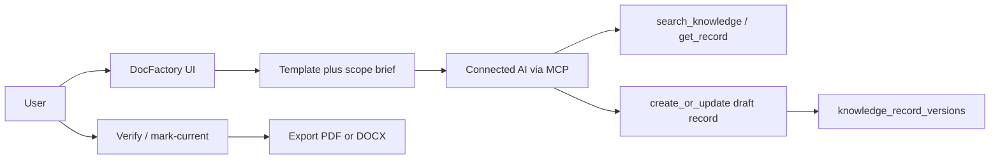

# Doc Factory

**Status:** Parked — backlog item NF-001 in [`NEXT_FEATURES.md`](NEXT_FEATURES.md); awaiting a precise module brief before implementation  
**Last updated:** 2026-07-20  
**Related:** ADR-008 (Markdown canonical), ADR-013 (draft-only MCP writes), ADR-006 (verification lifecycle), ADR-007 (provenance)

## Summary

Doc Factory lets users produce **standard documents** (overview, management summary, progress summary, and later templates) from knowledge already held in a workspace. A **connected AI tool** (for example Cursor via MCP) gathers sources and writes Markdown drafts back into the hub. Humans review and promote lifecycle; the hub versions content and later exports to PDF and DOCX.

Generation model for v1 is **hybrid**: the hub owns templates, scoping, versioning, and export; the connected AI fills drafts via existing MCP read/write tools. There is **no hub-side LLM provider** in v1.

## Goals

* Reuse workspace knowledge (records, projects, systems) as the source for standardized deliverables.
* Keep generated documents as first-class, **versioned** knowledge records (same lifecycle and history as any other record).
* Make AI output **non-authoritative by default** (draft + `ai_generated_draft` until a human verifies).
* Support outbound export to **PDF** and **DOCX** from canonical Markdown.
* Give connected agents clear templates and briefs so outputs are consistent.

## Non-goals (v1)

* Server-side LLM API keys, provider billing, or generation jobs inside the worker.
* Auto-promoting AI drafts to `verified` / `current`.
* Importing PDF/DOCX/PPTX back into the hub (extraction remains deferred in the PRD).
* Replacing Git-synced docs as source of truth for git-managed series.
* PowerPoint or other slide formats.
* Collaborative real-time editing of factory documents.

## Concepts

### Template

A Doc Factory **template** defines:

| Field | Purpose |
| --- | --- |
| `id` | Stable slug (e.g. `overview`, `management-summary`, `progress-summary`) |
| `recordType` | Knowledge record type to create/update |
| `label` / `description` | UI and MCP discovery copy |
| `outlineSections` | Ordered section headings the AI should cover |
| `mcpInstructions` | Concise instructions for the connected agent |
| `defaultTags` | Optional tags (e.g. `doc-factory`, template id) |

Templates live in domain code first (same package as record types). A later API exposes them as `GET /api/v1/doc-factory/templates`.

### Scope

Generation is scoped to exactly one of:

* **Workspace** — whole workspace catalogue and records
* **Project** — one project (+ its systems/records)
* **System** — one system (+ related records)

Scope is stored on the record via `projectId` / `systemId` (null = workspace-level) and reflected in the brief.

### Factory series

One logical document series per `(workspaceId, scope, templateId)`:

* First run **creates** a knowledge record (draft, `ai_generated_draft`).
* Regenerate **updates** the same record (new immutable version + `changeMessage`).
* If duplicates appear, humans use existing **mark-current** to supersede siblings in the series.

Recommended metadata (implementation phase):

* Tag `doc-factory` plus `doc-factory:<templateId>`
* Optional `metadata.factoryTemplateId` when metadata JSON is wired for this purpose

### Brief

A **brief** is a structured payload the hub (or MCP tool) returns so the agent does not dump the entire workspace into context:

* Template id, outline, MCP instructions
* Scope identifiers and names
* Ranked candidate source records (search relevance / type filters)
* Existing factory record id if regenerating
* Hard constraints: draft-only write, cite provenance, stay within outline

## End-to-end flow

1. User opens **Document factory** on a workspace (implementation Phase B).
2. User picks a **template** and **scope** (optional short human note).
3. Hub shows **Prepare for AI**: copyable prompt + deep link to scope / existing draft.
4. Connected AI uses MCP: `search_knowledge` / `get_knowledge_record` / catalogue tools, then `create_knowledge_record` or `update_knowledge_record`.
5. User reviews the draft in the normal record UI; may edit Markdown; then **verify** / **mark-current**.
6. User **exports** PDF or DOCX from the record page (implementation Phase D).

## Initial template catalog

| Template id | Record type | Audience | Outline (sections) |
| --- | --- | --- | --- |
| `overview` | `overview` | Technical + stakeholders | Purpose; Scope; Key projects/systems; Architecture snapshot; Operations notes; Open risks |
| `management-summary` | `management-summary` | Leadership | Situation; Outcomes / value; Progress vs plan; Risks & decisions needed; Next period focus |
| `progress-summary` | `progress-summary` | Delivery stakeholders | Period; Completed; In progress; Blocked; Upcoming; Metrics / evidence (link to hub records) |

Further templates (architecture brief, runbook pack, etc.) extend the same registry without changing the pipeline.

Record types `management-summary` and `progress-summary` are added to the domain catalog on this spike so MCP field guides can surface them early. `overview` already exists.

## Storage and lifecycle

* Canonical body: **Markdown** (ADR-008).
* `sourceOfTruthMode`: `ai_generated_draft` on MCP create/update (ADR-013).
* Provenance: `generatedByModel`, optional `sourceTitle`, knowledge source type `conversation` when applicable (ADR-007).
* Lifecycle: starts `draft`; only humans promote via session API.
* Versioning: every content regenerate bumps `currentVersionNumber` and inserts `knowledge_record_versions` (Milestone 4).

Factory documents remain **editable** in the hub after AI write. Subsequent human edits also version normally.

## MCP affordances

**v1 (spike / Phase C):** Prefer existing tools plus richer discovery:

* Extend `list_record_metadata` / field guides with Doc Factory template summaries.
* Optional tool `prepare_standard_document`: returns a brief (outline + candidate sources + existing record id) **without** calling an LLM.
* Writes remain `create_knowledge_record` / `update_knowledge_record` only.

Do not add MCP tools that verify or mark-current.

## Export

Canonical format stays Markdown. Export is a **derived** artifact:

| Format | Approach (implementation) |
| --- | --- |
| PDF | Markdown → structured layout (pdfkit or HTML intermediate); reuse lessons from audit PDF headers/footers lightly |
| DOCX | Markdown → DOCX via a maintained library (e.g. `docx`) or worker-side conversion |

API shape (Phase D): `GET /api/v1/knowledge-records/:id/export?format=pdf|docx` with workspace authz. UI: download actions on the record page.

Export styling should use light brand tokens (product name, accent) — not invent a second document CMS.

## Audit and security

* Creating/updating factory records audits like any knowledge write.
* Export downloads should be audited (same pattern as audit-log export).
* Authorization: workspace membership required; MCP writes still require `knowledge:write`, acting user, and workspace allowlist.
* Untrusted Markdown rules (ADR-010) apply to rendered HTML; export pipelines must not execute scripts.

## Risks and mitigations

| Risk | Mitigation |
| --- | --- |
| Large workspaces blow agent context | Brief lists top-N relevant records; agent fetches selectively |
| Stale or incomplete sources | Prefer `current` / `verified` in search ranking; surface freshness in brief |
| Duplicate factory records | Series identity + regenerate-on-same-record guidance; mark-current for cleanup |
| Over-trusting AI output | Draft-only MCP; UI badges; no auto-verify |
| Export ≠ Markdown fidelity | Treat export as best-effort presentation; Markdown remains editable source |

## Implementation phases

Documented here for sequencing after design approval. **This spike does not implement UI, export, or MCP tools.**

| Phase | Work |
| --- | --- |
| **A – Templates** | Domain template defs; `GET /api/v1/doc-factory/templates` |
| **B – Hub UX** | Workspace “Document factory” page: template + scope, existing series, prepare-for-AI copy |
| **C – MCP** | Template discovery in metadata; optional `prepare_standard_document` |
| **D – Export** | PDF/DOCX export endpoint + record-page downloads |
| **E – Polish** | Locale-aware templates, regenerate change messages, audit events, i18n |

Suggested first implementation PR after this spike: **Phase A + B** or **A + C**, depending on whether hub UX or agent ergonomics is the priority.

## Spike deliverables (this branch)

* This design document
* Roadmap / milestone tracking note (exploratory; does not displace M9)
* Domain record types: `management-summary`, `progress-summary`

## Success criteria

* Architecture is decided without open option forks (hybrid MCP generation; Markdown + versions; export later).
* Next implementation PR scope is clear from the phase table.
* New record types validate in domain tests and appear in MCP enum lists via `RECORD_TYPES`.
