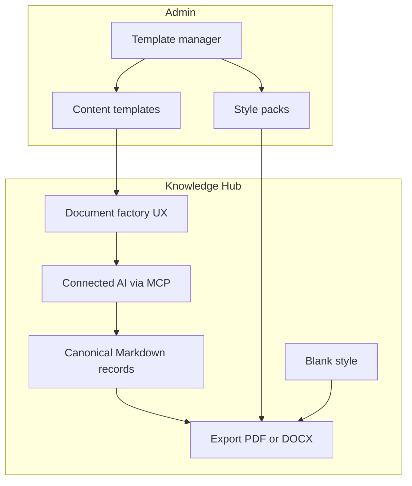

# Doc Factory

**Status:** Parked — backlog item NF-001 in [`NEXT_FEATURES.md`](NEXT_FEATURES.md); module brief expanded 2026-07-27 (content templates + style packs + Admin template manager)  
**Last updated:** 2026-07-27  
**Related:** ADR-008 (Markdown canonical), ADR-013 (draft-only MCP writes), ADR-006 (verification lifecycle), ADR-007 (provenance), NF-006 BlobStore (store uploaded style assets)

## Summary

Doc Factory is the hub’s **outbound document standardization** package. It turns workspace knowledge into **versioned Markdown drafts** and **styled PDF/DOCX exports** for technical, legal, audit, and management use — without turning the hub into a Word editor.

The package has three layers:

1. **Content templates** — outlines / instructions that shape what goes into a knowledge record (overview, management summary, later legal/audit packs).
2. **Style packs** — Word-like presentation (fonts, headings, cover, header/footer, logo) applied at **export** time. Users pick a pack or **Blank**.
3. **Forged documents (later)** — merge selected hub records into a content template, then export with a style pack.

Generation model for early slices is **hybrid**: the hub owns templates, scoping, versioning, style packs, and export; a **connected AI** (Cursor / ChatGPT via MCP or Actions) fills Markdown drafts via existing write tools. There is **no hub-side LLM provider** in v1.

```mermaid
flowchart TB
  subgraph admin [Admin]
    tm[Template manager]
    tm --> ct[Content templates]
    tm --> sp[Style packs]
  end
  subgraph hub [Knowledge Hub]
    md[Canonical Markdown records]
    df[Document factory UX]
    ct --> df
    df --> agent[Connected AI via MCP]
    agent --> md
    md --> export[Export PDF or DOCX]
    sp --> export
    blank[Blank style] --> export
  end
```

## Goals

* Reuse workspace knowledge as the source for standardized deliverables.
* Keep generated documents as first-class, **versioned** knowledge records (same lifecycle and history).
* Make AI output **non-authoritative by default** (draft + `ai_generated_draft` until a human approves).
* Support outbound **PDF** and **DOCX** from canonical Markdown.
* Let org admins manage **style packs** (corporate look) and eventually **content templates**.
* Let users export any eligible record with a **selected style pack** or **Blank**.
* Later: forge multi-source content into pre-defined content+style combinations for legal / audit / technical packs.

## Non-goals

* Server-side LLM API keys, provider billing, or generation jobs inside the worker (v1).
* Auto-promoting AI drafts to `verified` / `current`.
* Turning the hub into a WYSIWYG Word processor.
* Perfect round-trip fidelity (export is best-effort presentation; Markdown remains editable source).
* Importing PDF/DOCX/PPTX as editable Word clones (inbound ingest is NF-015 MarkItDown → Markdown drafts).
* PowerPoint / slide decks in v1.
* Collaborative real-time editing of factory documents.
* Graph OneDrive as the sole document store (export downloads + optional BlobStore retention only).

---

## Package shape (how it looks in the product)

### Surfaces

| Surface | Who | Purpose |
| --- | --- | --- |
| **Admin → Templates** (Doc Factory) | Org admin | Manage **style packs** (upload/activate/archive) and later **content templates**; preview export sample |
| **Workspace → Document factory** | Members | Pick **content template** + **scope**, prepare AI brief, open/regenerate factory series |
| **Record page → Export** | Members | Download PDF/DOCX; choose **style pack** or **Blank** |
| **MCP / OpenAPI** | Agents | Discover content templates; `prepare_standard_document` brief; existing create/update drafts; no verify/mark-current |

### Suggested code layout (when implemented)

| Area | Home |
| --- | --- |
| Domain catalog (content template defs, record types) | `packages/domain` (extend existing record-type catalog) |
| Export pipeline (Markdown → DOCX/PDF + style application) | New package e.g. `@project-knowledge-hub/doc-export` used by API/worker |
| Style pack storage | BlobStore purpose `doc-templates` (NF-006); DB metadata table for packs |
| Admin APIs | `/api/v1/admin/doc-factory/...` |
| Member APIs | `/api/v1/doc-factory/templates`, `/api/v1/knowledge-records/:id/export` |
| Web | Admin Templates page; workspace Document factory page; record Export modal |

Markdown stays canonical (ADR-008). Style packs never replace the record body.

---

## Concepts

### Content template

Defines **what** the document should contain (structure + agent guidance):

| Field | Purpose |
| --- | --- |
| `id` | Stable slug (e.g. `overview`, `management-summary`, `audit-pack`) |
| `recordType` | Knowledge record type to create/update |
| `label` / `description` | UI and MCP discovery copy |
| `outlineSections` | Ordered section headings the AI (or forge step) should cover |
| `mcpInstructions` | Concise instructions for the connected agent |
| `defaultTags` | Optional tags (e.g. `doc-factory`, template id) |
| `defaultStylePackId` | Optional preferred style pack for exports of this series |

**v1 storage:** domain code registry (same package as record types), exposed via `GET /api/v1/doc-factory/templates`.  
**Later:** Admin-editable content templates (org overrides) stored in DB + optional BlobStore for long instruction packs.

### Style pack

Defines **how** exports look (Word-like presentation). Applied only at export time.

| Field | Purpose |
| --- | --- |
| `id` | UUID / stable slug |
| `label` | e.g. `Corporate letterhead`, `Audit report`, `Blank` |
| `formats` | `docx`, `pdf` (or both) |
| `assets` | Logo, DOCX base/skeleton, CSS/tokens for PDF path |
| `typography` | Heading/body fonts, sizes, colors (mapped from Markdown) |
| `chrome` | Cover page, header/footer, page size, margins, disclaimer |
| `status` | `active` / `archived` |

**Blank** is a built-in pack: clean defaults, no logo/letterhead — always available.

Admins upload or configure packs under **Admin → Templates**. Binary assets live in BlobStore; metadata in Postgres.

### Scope

Generation is scoped to exactly one of:

* **Workspace** — whole workspace catalogue and records  
* **Project** — one project (+ its systems/records)  
* **System** — one system (+ related records)

Scope is stored on the record via `projectId` / `systemId` (null = workspace-level) and reflected in the brief.

### Factory series

One logical document series per `(workspaceId, scope, contentTemplateId)`:

* First run **creates** a knowledge record (draft, `ai_generated_draft`).
* Regenerate **updates** the same record (new immutable version + `changeMessage`).
* If duplicates appear, humans use existing **Approve / mark-current** to supersede siblings.

Recommended metadata:

* Tag `doc-factory` plus `doc-factory:<contentTemplateId>`
* Optional `metadata.factoryTemplateId` / `metadata.preferredStylePackId`

### Brief

Structured payload so the agent does not dump the entire workspace:

* Content template id, outline, MCP instructions  
* Scope identifiers and names  
* Ranked candidate source records  
* Existing factory record id if regenerating  
* Hard constraints: draft-only write, cite provenance, stay within outline  

### Forged document (later phase)

A **forge** job selects one or more hub records (and/or catalogue entities), maps them into a content template’s sections (rules + optional AI assist), writes/updates a factory draft, then the user exports with a style pack. Same lifecycle rules: draft until human approve.

---

## End-to-end flows

### A — Style-only export (any record)

1. User opens a knowledge record.  
2. **Export** → choose format (PDF / DOCX) → choose **style pack** or **Blank**.  
3. Hub renders Markdown through the export pipeline with that pack.  
4. Download is audited.

### B — Content template + AI fill (Document factory)

1. User opens **Document factory** on a workspace.  
2. Pick **content template** + **scope** (optional human note).  
3. Hub shows **Prepare for AI**: copyable prompt + deep links.  
4. Connected AI uses MCP search/get + create/update draft.  
5. Human reviews, edits Markdown, **Approves** / mark-current.  
6. Export with preferred or selected **style pack**.

### C — Forged pack (later)

1. User (or agent) picks content template + sources + style pack.  
2. Hub forges section Markdown into a draft record.  
3. Human review → export.

---

## Initial content template catalog

| Template id | Record type | Audience | Outline (sections) |
| --- | --- | --- | --- |
| `overview` | `overview` | Technical + stakeholders | Purpose; Scope; Key projects/systems; Architecture snapshot; Operations notes; Open risks |
| `management-summary` | `management-summary` | Leadership | Situation; Outcomes / value; Progress vs plan; Risks & decisions needed; Next period focus |
| `progress-summary` | `progress-summary` | Delivery stakeholders | Period; Completed; In progress; Blocked; Upcoming; Metrics / evidence |

Further templates (architecture brief, runbook pack, **legal memo**, **audit evidence pack**, etc.) extend the same registry without changing the pipeline.

Record types `management-summary` and `progress-summary` already exist in the domain catalog from the earlier spike. `overview` already existed.

---

## Storage and lifecycle

* Canonical body: **Markdown** (ADR-008).  
* `sourceOfTruthMode`: `ai_generated_draft` on MCP create/update (ADR-013).  
* Provenance: `generatedByModel`, optional `sourceTitle` (ADR-007).  
* Lifecycle: starts `draft`; only humans promote via session API.  
* Versioning: every content regenerate bumps versions (Milestone 4).  
* Style packs: BlobStore + DB; versioned so old exports can pin a pack revision if needed later.

Factory documents remain **editable** in the hub after AI write. Subsequent human edits version normally.

---

## MCP affordances

* Extend `list_record_metadata` / field guides with Doc Factory content-template summaries and export notes.  
* Optional tool `prepare_standard_document`: returns a brief **without** calling an LLM.  
* Writes remain `create_knowledge_record` / `update_knowledge_record` only.  
* Do **not** add MCP tools that Approve / mark-current.  
* Optional later: `list_style_packs` (read) for agents that trigger export via API.

---

## Export

Canonical format stays Markdown. Export is a **derived** artifact:

| Format | Approach |
| --- | --- |
| DOCX | Markdown → DOCX via maintained library (e.g. `docx`) or worker conversion; map headings/lists/tables/images into the **style pack** skeleton |
| PDF | Markdown → HTML/CSS intermediate (pack tokens) → PDF; or DOCX→PDF via LibreOffice in worker if fidelity needs match |

API shape: `GET /api/v1/knowledge-records/:id/export?format=pdf|docx&stylePackId=<id|blank>` with workspace authz.  
UI: Export modal on the record page (format + style pack picker).

**Fidelity rule:** export is presentation; if Word users need perfect `.dotx` clones, treat that as an advanced style-pack capability, not a blocker for Blank + light corporate packs.

---

## Admin → Templates (manager)

Org-admin only:

* List / activate / archive **style packs**  
* Upload logo + base DOCX (or configure token-based pack without upload)  
* Built-in **Blank** (not deletable)  
* Later: CRUD for org **content templates** (override domain defaults)  
* Sample export preview against a fixed fixture Markdown  

Authorization: same Admin gate as Monitoring / Storage. Audit `doc_factory.style_pack.*` / `doc_factory.content_template.*` and every export download.

---

## Audit and security

* Factory create/update audits like any knowledge write.  
* Export downloads audited (format, stylePackId, record id, actor).  
* Workspace membership for export; MCP writes still need `knowledge:write`, acting user, workspace allowlist.  
* Untrusted Markdown rules (ADR-010) apply; export must not execute scripts.  
* Uploaded style assets treated as trusted-admin content (virus scan / size limits later as needed).

---

## Risks and mitigations

| Risk | Mitigation |
| --- | --- |
| Large workspaces blow agent context | Brief lists top-N records; agent fetches selectively |
| Stale sources | Prefer `current` / `verified` in ranking; surface freshness |
| Duplicate factory records | Series identity + regenerate guidance; mark-current cleanup |
| Over-trusting AI | Draft-only MCP; Approve wording; no auto-verify |
| Export ≠ Markdown fidelity | Best-effort presentation; Markdown remains source |
| Style packs become a mini CMS | Keep packs presentation-only; content stays in records |
| Perfect Word clone expectations | Ship Blank + token packs first; advanced `.dotx` later |

---

## Implementation phases

| Phase | Work |
| --- | --- |
| **A – Content templates** | Domain defs; `GET /api/v1/doc-factory/templates` |
| **B – Factory UX** | Workspace Document factory: content template + scope, series, prepare-for-AI |
| **C – MCP** | Template discovery in metadata; optional `prepare_standard_document` |
| **D – Export + Blank** | PDF/DOCX export endpoint; Blank style; record Export UI |
| **E – Style packs + Admin manager** | BlobStore assets; Admin → Templates; style picker on export |
| **F – Polish** | Locale-aware templates, audit events, i18n, pack versioning |
| **G – Forge** | Multi-source content forge into content templates + preferred style |

Suggested first implementation slice after design approval: **A + B** or **A + C**, then **D** (Blank export) before rich style packs (**E**).

---

## Spike deliverables (already landed)

* This design document (expanded)  
* Domain record types: `management-summary`, `progress-summary`  
* Backlog row NF-001 in [`NEXT_FEATURES.md`](NEXT_FEATURES.md)

## Success criteria

* Package boundaries are clear: content templates vs style packs vs forge.  
* Admin Templates + user Export + Document factory surfaces are defined.  
* Markdown remains SoT; export/styles are derived.  
* Next implementation PR can start at Phase A without reopening architecture forks.
